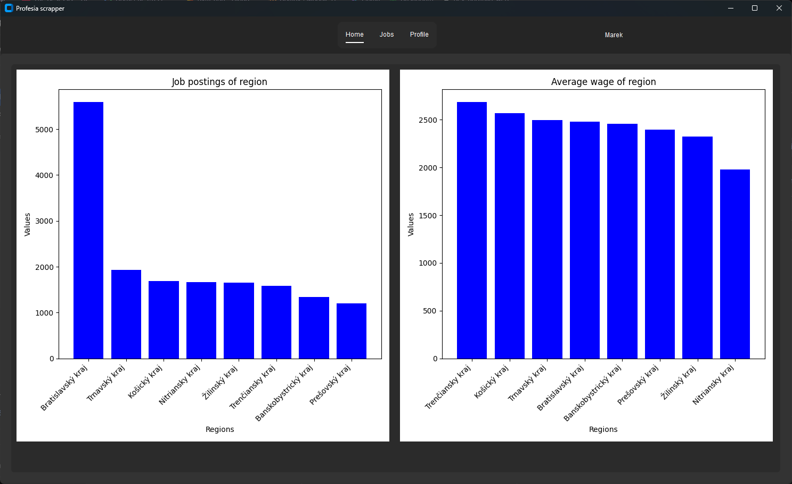
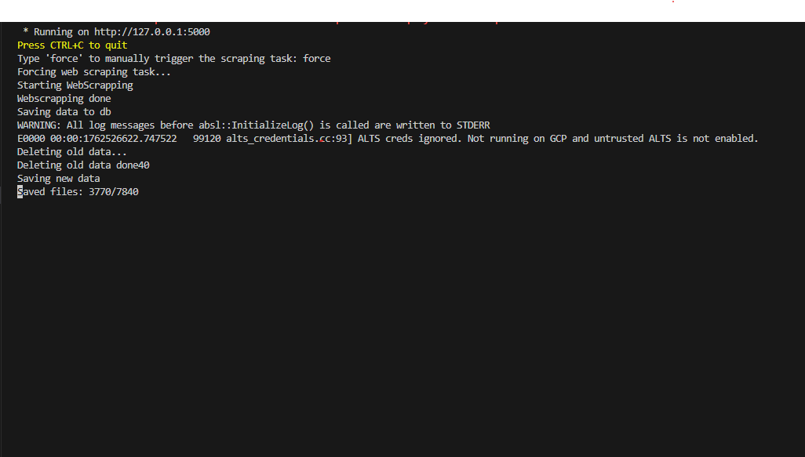

# 💼 ProfesiaScrapper

> A web scraping and data visualization application that gathers real-time job market data from [profesia.sk](https://www.profesia.sk).

---

## 🖼️ Overview

**ProfesiaScrapper** is a Python-based application designed to collect and analyze data from the Slovak job portal **profesia.sk**.  
Its main goal is to provide up-to-date information about the number of job offers and the average salary across different regions of Slovakia.

The project consists of two main parts:

1. **Server Application** – Automatically scrapes data from *profesia.sk* every hour and stores it in a **Firestore** database.  
2. **Client Application** – Provides a user-friendly interface where registered users can log in and visualize job market data in the form of interactive bar charts.

This makes **ProfesiaScrapper** a useful tool for tracking the dynamics of Slovakia’s labor market — helping users analyze job opportunities and salary trends by region.

---

## 🧰 Tech Stack

**Other Tools:**
- `customtkinter` – GUI framework for the desktop client  
- `schedule` – Automated job scheduling  
- `threading` – Parallel execution for scraping and updates  
- `dotenv` – Environment variable management  
- `dataclasses`, `os`, `time`, `re`, `requests` – Core Python modules for system, timing, and regex handling  

---

## 🎬 Showcase

### 🖼️ Interface Preview

| Client| Server|
|:--:|:--:|
|  |  |

Data from 7.11.2025

### 📊 Data Visualization

> 

---

## 💡 Project Highlights

- 🌍 Automated hourly data scraping from [profesia.sk](https://www.profesia.sk)  
- 🧾 Real-time updates stored in **Firebase Firestore**  
- 👥 User authentication with login and registration  
- 📈 Interactive visualizations of job counts and average salaries by region  
- ⚙️ Background scheduling and multithreading for performance  
- 🪟 Modern GUI built using **customtkinter**  

---

## 🧭 The Process

1. **Web Scraping Setup** – Implemented scraping logic using `BeautifulSoup` and `requests`.  
2. **Data Storage** – Connected to Firebase Firestore for persistent cloud data storage.  
3. **Server Development** – Built a Flask server for data collection and API management.  
4. **Automation** – Used `schedule` and `threading` for hourly scraping tasks.  
5. **Frontend & Visualization** – Designed GUI in `customtkinter` and generated graphs using `matplotlib`.  
6. **Authentication** – Integrated Firebase Auth for user registration and login.  

---

## 📚 What I Learned

- Automating web scraping with BeautifulSoup and Python  
- Working with Firebase Firestore and Firebase Authentication  
- Implementing scheduling and multithreading for background processes  
- Building interactive GUIs with `customtkinter`  
- Designing clean visualizations using `matplotlib`  
- Managing environment variables and secrets securely  

---

## 🏁 Conclusion

**ProfesiaScrapper** provides a complete pipeline, from real-time data collection to user-friendly visualization, for monitoring Slovakia’s job market trends.  
It demonstrates web scraping, data processing, cloud integration, and GUI development skills, showing how Python can be used to build full-featured applications.

---

## 🔗 Resources

- [profesia.sk](https://www.profesia.sk) – Data source  
